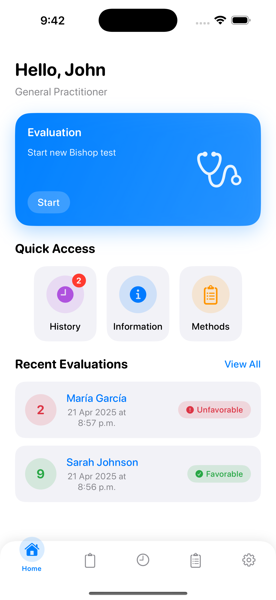

# BishopTest

BishopTest is an iOS application designed for obstetric professionals to perform the Bishop Score Test - a scoring system that assesses the cervix during labor and helps predict whether labor induction will be needed. This medical tool assists healthcare providers in making evidence-based decisions for labor induction.

## Features

- **Bishop Score Calculation**: Evaluate all parameters of the Bishop Score (dilation, effacement, consistency, position, and station)
- **Score Modifiers**: Apply clinical modifiers based on patient conditions (preeclampsia, previous deliveries, post-term pregnancy, etc.)
- **Personalized Recommendations**: Get tailored recommendations based on the score results
- **Patient History**: Save and review previous evaluations for easy follow-up
- **Induction Methods Reference**: Access comprehensive information about induction methods with indications, contraindications, and risks
- **Educational Content**: Read detailed information about the Bishop Score and its clinical applications
- **Multi-language Support**: Available in English and Spanish
- **Dark Mode Support**: Comfortable viewing in any lighting conditions

## Screenshots

<p align="center">
  
  
  
  
</p>

## Project Structure

```
BishopTest/
├── Models/                   # Data models and business logic
│   ├── BishopScore.swift     # Core Bishop Score model with calculations
│   ├── DataStore.swift       # Data persistence and management
│   ├── InductionMethod.swift # Models for induction methods
│   └── MedicalSpecialties.swift # Medical specialty definitions
├── Views/                    # UI components and screens
│   ├── BishopScore/          # Score calculation views
│   │   ├── BishopScoreView.swift # Main score calculation view
│   │   └── ResultView.swift  # Result display after calculation
│   ├── History/              # Patient history management
│   │   └── HistoryView.swift # History list and search
│   ├── Information/          # Educational content
│   │   ├── InformationView.swift        # General information view
│   │   ├── InductionMethodsView.swift   # Methods list view
│   │   └── InductionMethodDetailView.swift # Detailed method view
│   ├── Main/                 # Main application flow
│   │   ├── HomeView.swift    # Home dashboard
│   │   └── MainTabView.swift # Tab navigation container
│   ├── Onboarding/           # First-time user experience
│   │   ├── OnboardingView.swift     # Onboarding flow
│   │   └── SpecialtyPickerView.swift # Medical specialty selector
│   ├── Settings/             # User preferences
│   │   └── SettingsView.swift # App settings management
│   └── SplashView/           # App launch experience
│       └── SplashView.swift  # Animated splash screen
├── Utilities/                # Helper functions and extensions
│   ├── Constants.swift       # App-wide constants
│   ├── DesignSystem.swift    # UI design system components
│   └── Extensions.swift      # Swift extensions
├── Controllers/              # Business logic controllers
│   ├── AppController.swift   # Main app controller
└── Resources/                # App resources
    └── Localizable.xcstrings # Localization strings
```

## Technical Details

- **Platform**: iOS 17.6+ (Compatible with iPhone)
- **Framework**: SwiftUI
- **Architecture**: MVVM pattern
- **Persistence**: FileManager for storing score history
- **Localization**: English and Spanish support
- **UI/UX**: Custom design system with adaptable dark mode

## Core Components

### BishopScore Model

The central model that calculates and interprets the Bishop Score based on the following parameters:

- **Dilation**: Cervical dilation (0cm, 1-2cm, 3-4cm, ≥5cm)
- **Effacement**: Cervical effacement percentage (0-30%, 40-50%, 60-70%, ≥80%)
- **Consistency**: Cervical consistency (Firm, Medium, Soft)
- **Position**: Cervical position (Posterior, Middle, Anterior)
- **Station**: Fetal station (-3, -2, -1/0, +1/+2)

### Score Modifiers

Clinical modifiers that can influence the interpretation:

- Preeclampsia (+1)
- Previous vaginal deliveries (+1 per delivery)
- Post-term pregnancy (-1)
- Nulliparity (-1)
- Premature rupture of membranes (-1)

### Score Interpretation

- **≥8 points**: Favorable cervix - high probability of successful induction
- **6-7 points**: Moderately favorable cervix - induction possible, especially for multiparous women
- **≤5 points**: Unfavorable cervix - cervical ripening recommended before induction

## Installation for Development

1. Clone this repository
2. Open the `BishopTest.xcodeproj` file in Xcode 16 or later
3. Select your target device (iOS 17.6+ required)
4. Build and run the project

## Contributing
 If you're interested in contributing, please reach out to my profile.

## License

BishopTest is released under an appropriate license for medical applications. See the LICENSE file for more details.

## Acknowledgments

- Originally based on the Bishop Score developed by Dr. Edward Bishop in 1964
- Scientific validation based on current obstetric guidelines
- Designed for and with the feedback of practicing obstetric professionals
